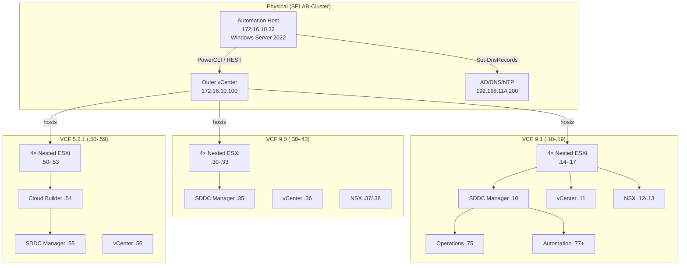

# rtolab — Architecture

## Overview

rtolab runs three VCF versions simultaneously on a shared physical cluster (SELAB-Cluster).
Each version gets its own non-overlapping IP range, nested ESXi VMs, and management stack.

```
┌─────────────────────────────────────────────────────────────────┐
│  SELAB-Cluster  (Physical)                                       │
│  Outer vCenter: 172.16.10.100  (vc-mgmt.vmware.taiwan)          │
│  Resource Pool: Kosten   Datastore: vsanDatastore-RTO            │
│                                                                  │
│  ┌─────────────────┐ ┌──────────────────┐ ┌──────────────────┐  │
│  │  VCF 9.1        │ │  VCF 9.0         │ │  VCF 5.2.1       │  │
│  │  .10–.19        │ │  .30–.43         │ │  .50–.59         │  │
│  │                 │ │                  │ │                  │  │
│  │  4× nested ESXi │ │  4× nested ESXi  │ │  4× nested ESXi  │  │
│  │  .14–.17        │ │  .30–.33         │ │  .50–.53         │  │
│  │                 │ │                  │ │                  │  │
│  │  SDDC .10       │ │  SDDC .35        │ │  SDDC .55        │  │
│  │  vC   .11       │ │  vC   .36        │ │  vC   .56        │  │
│  │  NSX  .12/.13   │ │  NSX  .37/.38    │ │  NSX  .57/.58    │  │
│  │  Ops  .75/.76   │ │  Ops  .40/.41    │ │  CloudBld .54    │  │
│  │  Auto .77+      │ │                  │ │                  │  │
│  │  VKS  .101+     │ │                  │ │                  │  │
│  └─────────────────┘ └──────────────────┘ └──────────────────┘  │
│                                                                  │
│  Shared: AD/DNS 192.168.114.200  │  Automation host 172.16.10.32│
└─────────────────────────────────────────────────────────────────┘
```

## VLAN / Network Architecture

```
Outer trunk portgroup (VLAN 0–4094)
├── VLAN 114  192.168.114.0/24  Management  (VMs + vmk0)
├── VLAN 115  192.168.115.0/24  vMotion     (vmk1)
├── VLAN 116  192.168.116.0/24  vSAN        (vmk2)
└── VLAN 117  192.168.117.0/24  NSX TEP     (vmk3)
                                 ├── VCF 9.1 TEP: .32–.95
                                 ├── VCF 9.0 TEP: .96–.159
                                 └── VCF 5.2.1:   .160–.223
```

## Layer Execution Flow

```
Layer 1: Prepare-NestedESXi.ps1
│  Deploy nested ESXi VMs from OVA (vmx-19 required)
│  Apply vSAN/LSOM advanced settings (6 keys, idempotent)
│  Configure vmk0/vmk1/vmk2/vmk3
▼
Layer 2: New-VcfLab.ps1 (wrapper)
│  Generate-BringupSpec.ps1  →  JSON spec for installer
│  _add_auto_ops_spec.ps1    →  adds Automation+Ops+Collector+License+vIDB
│  Submit-BringupSpec.ps1    →  POST to installer API, poll every 60s
│  (apply timeout-tuning.md workarounds before submitting)
▼
Layer 3: Post-bringup
│  Commission workload domains
│  Configure NSX routing / edges
│  Bootstrap VCF Automation (VCFA)
│  Access Supervisor / VSP
▼
Layer 4: Day-2 Ops
│  Run-BatchUpgrade.ps1      →  batch ESXi upgrade from depot/ISO
│  Exit-MaintenanceMode-All  →  exit maintenance + version summary
│  Re-apply vSAN settings after upgrade
▼
Layer 5: VKS
   NSX VPC setup
   Supervisor activation
   VKS workload cluster
```

## Mermaid Diagram


