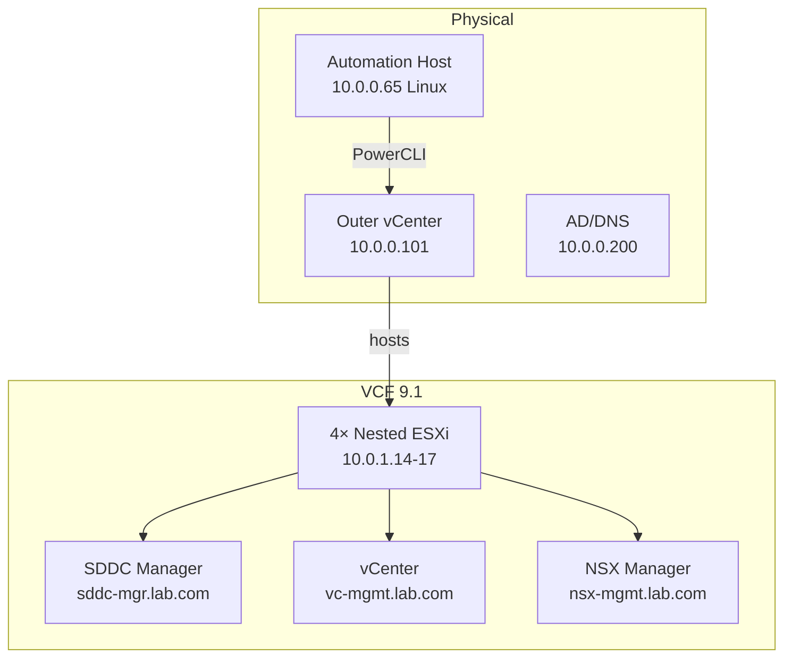

# vcf9.1-lab — Architecture

Single VCF 9.1 version. Reference/template repo — simpler than rtolab.

```
┌───────────────────────────────────────────────┐
│  Physical Cluster                              │
│  Outer vCenter: 10.0.0.101 (labvc.lab.com)    │
│                                                │
│  ┌──────────────────────────────────────────┐ │
│  │  VCF 9.1 Management Domain               │ │
│  │                                          │ │
│  │  4× Nested ESXi                          │ │
│  │  esx01–04.lab.com  (10.0.1.14–.17)       │ │
│  │                                          │ │
│  │  SDDC Manager  (sddc-mgr.lab.com)        │ │
│  │  inner vCenter (vc-mgmt.lab.com)         │ │
│  │  NSX Manager   (nsx-mgmt.lab.com)        │ │
│  └──────────────────────────────────────────┘ │
│                                                │
│  AD/DNS: 10.0.0.200 (dc01.lab.com)             │
│  Automation: 10.0.0.65 (Linux, labops)         │
└───────────────────────────────────────────────┘
```

## Network

```
Trunk portgroup (VLAN 0–4094)
├── VLAN 10  10.0.1.0/24  Management
├── VLAN 20  10.0.2.0/24  vMotion
├── VLAN 30  10.0.3.0/24  vSAN
└── VLAN 40  10.0.4.0/24  NSX TEP
```

## Mermaid Diagram


